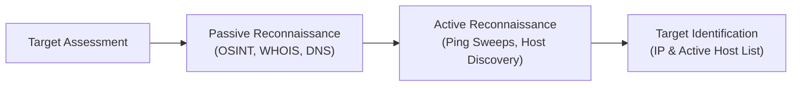

# Experiment 01: Theory & Conceptual Background

---

## 🔬 1. Reconnaissance Methodology

Reconnaissance is the initial preparatory phase of security auditing and penetration testing (NIST SP 800-115). It involves systematically gathering intelligence about a target system's network structure, host addresses, domain records, and exposed infrastructure.

---

## 🌐 2. Passive vs Active Reconnaissance

| Dimension | Passive Reconnaissance | Active Reconnaissance |
| :--- | :--- | :--- |
| **Direct Target Contact** | **None.** Queries third-party databases/caches | **Direct.** Packets sent directly to target IP |
| **Detection Risk** | Zero (Invisible to target network logs) | High (Target IDS/Firewall/SIEM logs probes) |
| **Techniques** | WHOIS lookups, DNS record enumeration, OSINT | ICMP Echo requests, ARP pinging, TCP SYN sweeps |
| **Primary Tools** | `whois`, `dig`, `nslookup`, Shodan, Google Dorks | `nmap`, `arping`, `fping`, `netdiscover` |

---

## 📜 3. Domain Name System (DNS) & WHOIS Concepts

### DNS Record Types
- **A Record:** Maps domain name to IPv4 address.
- **AAAA Record:** Maps domain name to IPv6 address.
- **MX Record:** Specifies mail exchange servers for domain.
- **NS Record:** Identifies authoritative name servers.
- **TXT Record:** Stores arbitrary text, SPF records, and domain verification tokens.
- **PTR Record:** Pointer record for reverse DNS lookups (IP to domain).

### WHOIS Protocol
WHOIS operates over TCP port 43 to query regional internet registries (RIRs such as ARIN, RIPE, APNIC) for domain registrar details, registrant contact info, creation/expiry dates, and name servers.

---

## 🔍 4. Host Discovery Techniques in Nmap

Host discovery determines which IP addresses on a network block are active ("alive") before conducting port scanning.

1. **ARP Ping (`-PR`):** Uses Address Resolution Protocol requests. Fast and 100% reliable on local Ethernet subnets (Layer 2).
2. **ICMP Echo Ping (`-PE`):** Sends standard ICMP Type 8 Echo Request packets.
3. **TCP SYN Ping (`-PS`):** Sends empty TCP SYN packet to port 80/443. A SYN-ACK or RST response proves the host is online.
4. **TCP ACK Ping (`-PA`):** Sends TCP ACK packet. Unsolicited ACK triggers RST response from live hosts, bypassing stateless firewalls.
