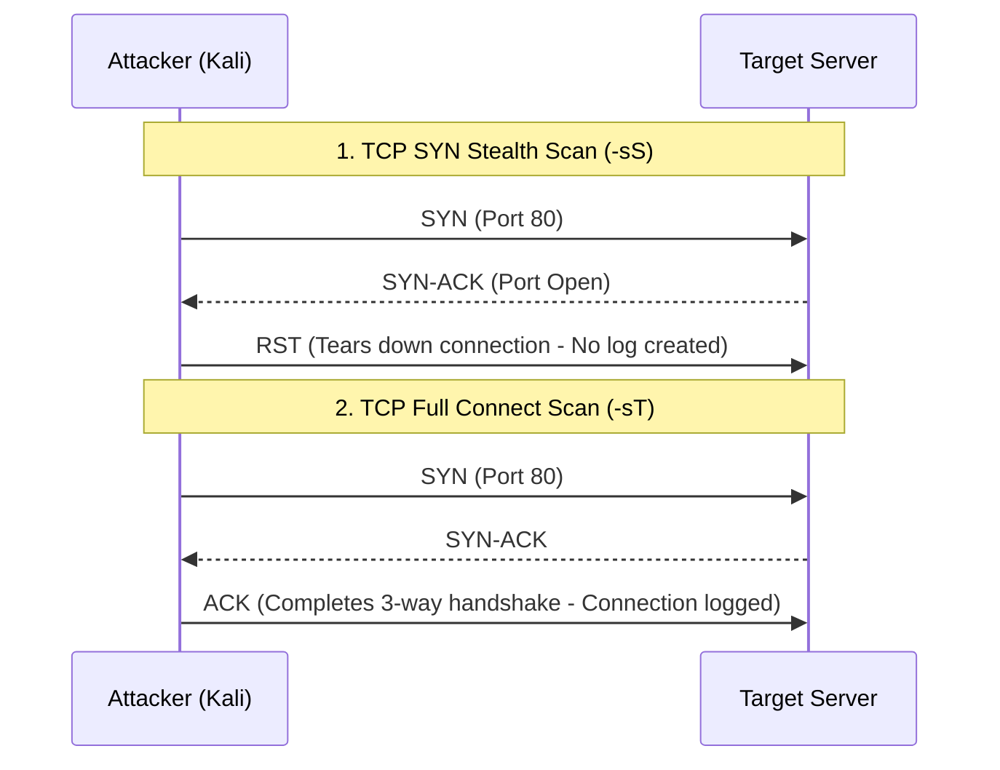

# Experiment 02: Theory & Conceptual Background

---

## 🔌 1. Port Architecture & TCP/UDP Protocols

Computer networking relies on transport layer ports (0-65535) to direct network traffic to specific application processes:
- **Well-Known Ports (0 – 1023):** Assigned to system services (HTTP: 80, SSH: 22, FTP: 21, DNS: 53).
- **Registered Ports (1024 – 49151):** Assigned by IANA for specific vendor software (MySQL: 3306, RDP: 3389).
- **Dynamic/Private Ports (49152 – 65535):** Used for ephemeral client connections.

---

## 🤝 2. TCP Scanning Techniques: SYN vs Full Connect

- **TCP SYN Stealth Scan (`-sS`):** Sends a SYN packet. If SYN-ACK is received, the port is open, and Nmap immediately sends a RST packet to tear down the connection without completing the 3-way handshake. Requires `root` privileges.
- **TCP Connect Scan (`-sT`):** Uses the OS `connect()` system call to complete the full 3-way handshake (SYN -> SYN-ACK -> ACK). Slower and logged by target applications.

---

## 🏷️ 3. Nmap Port States

1. **`open`:** An application is actively accepting TCP connections or UDP packets on this port.
2. **`closed`:** Port is accessible (receives Nmap probes), but no application is listening. Responds with RST (TCP) or ICMP Port Unreachable (UDP).
3. **`filtered`:** Firewall, filter, or network obstacle prevents probe packets from reaching the port. Nmap cannot determine if open or closed.
4. **`unfiltered`:** Port is accessible, but Nmap cannot determine whether it is open or closed (used in ACK scan `-sA`).

---

## 🕵️ 4. Service Versioning & OS Fingerprinting

- **Service Detection (`-sV`):** Nmap sends targeted probes from `nmap-service-probes` database to open ports, inspects banner responses, and matches regex patterns to determine software vendor, product, and version.
- **OS Fingerprinting (`-O`):** Sends TCP/UDP/ICMP probes and measures TCP window size, initial sequence number (ISN) predictability, TCP options ordering, and IP ID sequence generation to match against `nmap-os-db`.
