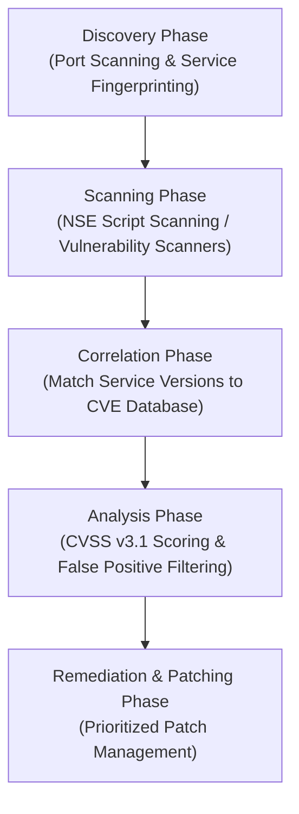

# Experiment 03: Theory & Conceptual Background

---

## 🔬 1. Vulnerability Assessment Lifecycle

Vulnerability Assessment (VA) is the technical process of discovering, identifying, categorizing, and prioritizing security flaws in hardware, operating systems, software daemons, and application configurations.

---

## 🏷️ 2. CVE & National Vulnerability Database (NVD)

- **CVE (Common Vulnerabilities and Exposures):** A standardized, publicly disclosed dictionary of cybersecurity vulnerabilities maintained by the MITRE Corporation (e.g., `CVE-2011-2523`).
- **NVD (National Vulnerability Database):** Maintained by NIST, NVD analyzes CVE records to assign severity scores using the Common Vulnerability Scoring System (CVSS) and provides fix/patch references.

---

## 📊 3. CVSS v3.1 Metrics Framework

CVSS v3.1 evaluates three metric groups:
1. **Base Metrics:** Inherent characteristics of a vulnerability unaffected by time or environment:
   - **Attack Vector (AV):** Network (N), Adjacent (A), Local (L), Physical (P).
   - **Attack Complexity (AC):** Low (L), High (H).
   - **Privileges Required (PR):** None (N), Low (L), High (H).
   - **User Interaction (UI):** None (N), Required (R).
   - **Scope (S):** Unchanged (U), Changed (C).
   - **Impact (C/I/A):** Confidentiality, Integrity, Availability (None, Low, High).
2. **Temporal Metrics:** Factors that change over time (exploit code maturity, patch availability).
3. **Environmental Metrics:** Context-specific factors unique to an organization's network architecture.

---

## ⚠️ 4. Service Version Correlation vs Scanner False Positives

> [!IMPORTANT]
> **Vulnerability Scanner Rule:** A scanner suggestion does NOT automatically prove vulnerability presence.
> Vulnerability assessment requires **version verification and patch auditing**:
> - **False Positive:** A scanner reports a vulnerability based purely on a version banner, but the software maintainer backported the security patch without bumping the public version string.
> - **Validation:** Always cross-reference discovered open port service versions (e.g., `vsftpd 2.3.4`, `Samba 3.0.20`, `Apache 2.2.8`) against NVD advisory details and changelogs.
