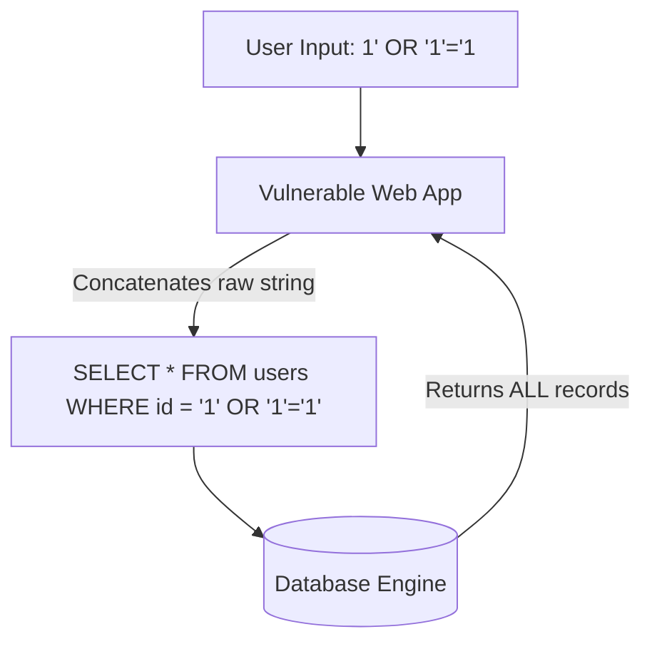

# Experiment 05: Theory & Conceptual Background

---

## 💉 1. SQL Injection (SQLi) Mechanics

SQL Injection occurs when untrusted user input is directly concatenated into a dynamic SQL query string without prior validation, filtering, or parameterization. This allows an attacker to alter the query's syntax and execute arbitrary SQL commands in the context of the application's database connection.



---

## 🎭 2. Classification of SQL Injection Vectors

1. **In-Band SQLi (Classic):** Attack results visible in same channel/page:
   - **Error-Based SQLi:** Database returns verbose error messages disclosing table names or database structure.
   - **UNION-Based SQLi:** Uses `UNION ALL SELECT` operator to append secondary query results to original dataset.
2. **Inferential SQLi (Blind):** No data or database errors returned directly on screen:
   - **Boolean-Based Blind:** Evaluates true/false page response variations.
   - **Time-Based Blind:** Uses database sleep functions (e.g., `SLEEP(5)`) to measure server response delay.
3. **Out-of-Band SQLi:** Triggers DNS/SMB requests from database engine to external listener.

---

## 🛡️ 3. Vulnerable vs Secure Code Analysis

### ❌ Insecure Code (String Concatenation in PHP/Python)
```php
// VULNERABLE: Direct string concatenation allows syntax hijacking
$id = $_GET['id'];
$query = "SELECT first_name, last_name FROM users WHERE user_id = '$id';";
$result = mysqli_query($db, $query);
```

### ✅ Secure Code (Prepared Statements & Parameterized Queries)
```php
// SECURE: Parameterized Query separates code logic from data input
$id = $_GET['id'];
$stmt = $db->prepare("SELECT first_name, last_name FROM users WHERE user_id = ?");
$stmt->bind_param("i", $id);
$stmt->execute();
$result = $stmt->get_result();
```

```python
# SECURE (Python SQLite3 Parameterization)
import sqlite3

cursor.execute("SELECT first_name, last_name FROM users WHERE user_id = ?", (user_id,))
```
