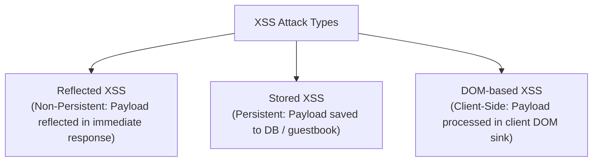

# Experiment 06: Theory & Conceptual Background

---

## 🎭 1. Classification of Cross-Site Scripting (XSS)

Cross-Site Scripting occurs when an application includes untrusted data in a web page without proper validation or output encoding, allowing client-side scripts (JavaScript) to execute in the victim's browser context.



- **Reflected XSS:** The malicious payload is delivered via HTTP request parameters (e.g., URL link) and echoed back in the server response immediately. Requires victim to click a crafted link.
- **Stored XSS (Persistent):** The malicious script is permanently stored in target database, comment fields, or forum logs. Executed automatically whenever any user views the affected page.
- **DOM-Based XSS:** The vulnerability exists entirely in client-side JavaScript where data from a **Source** (`location.search`, `document.referrer`) flows into an unsafe **Sink** (`eval()`, `innerHTML`, `document.write()`).

---

## 🧪 2. Harmless Proof-of-Concept Payloads

In authorized educational laboratories, XSS PoCs must remain harmless:
```html
<!-- Standard Harmless Alert PoC -->
<script>alert('XSS-Lab-06-PoC')</script>

<!-- Image Tag Event Handler PoC -->

```

---

## 🛡️ 3. Context-Aware Output Encoding Defenses

### ❌ Vulnerable Code (Raw Output Echo)
```php
// VULNERABLE: Direct echo allows script tags to be parsed by browser
echo "Hello, " . $_GET['name'];
```

### ✅ Secure Code (HTML Entity Encoding)
```php
// SECURE: Converts HTML special characters to harmless entities
// '<' becomes '&lt;', '>' becomes '&gt;'
echo "Hello, " . htmlspecialchars($_GET['name'], ENT_QUOTES, 'UTF-8');
```

```python
# SECURE (Python html module)
import html

safe_output = html.escape(user_input, quote=True)
```
