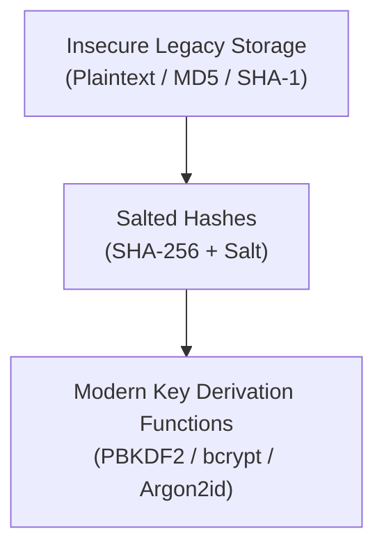

# Experiment 07: Theory & Conceptual Background

---

## 🔑 1. Password Storage Evolution

Storing user credentials securely requires cryptographic hashing functions specifically designed to be slow and computationally expensive.

### Hashing Algorithm Comparison

| Algorithm | Type | Salt Support | Work Factor / Cost Parameter | Resistance to GPU / ASIC Brute-Force | Recommended Status |
| :--- | :--- | :---: | :---: | :---: | :---: |
| **MD5** | Fast Hash | ❌ None | Fixed (Fast) | ❌ Broken (Giga-hashes/sec) | ⛔ **DEPRECATED** |
| **SHA-256** | Fast Hash | Optional | Fixed (Fast) | ❌ Vulnerable to GPU clusters | ⛔ **INSUFFICIENT** |
| **PBKDF2** | KDF | ✅ Mandatory | Iteration Count (e.g., 600,000) | ⚠️ Moderate | ✅ **NIST APPROVED** |
| **bcrypt** | KDF | ✅ Mandatory | Work Factor (e.g., 12) | ✅ High | ✅ **RECOMMENDED** |
| **Argon2id** | Memory-Hard | ✅ Mandatory | Iterations, Memory Cost, Parallelism | ✅ **EXCELLENT (PHC Winner)** | 🌟 **BEST PRACTICE** |

---

## 🧂 2. Cryptographic Salt & CSPRNG

- **Cryptographic Salt:** A unique, unpredictable sequence of random bytes (at least 16 bytes / 128 bits) appended to a password before hashing.
- **Purpose:** 
  1. Prevents precomputed **Rainbow Table** attacks.
  2. Ensures that two users with identical passwords (e.g., `Password123`) produce completely different stored hash strings.
- **CSPRNG Generation:** Salts must be generated using Cryptographically Secure Pseudo-Random Number Generators (`secrets` module in Python, `crypto.getRandomValues()` in JS), never standard `random()`.

---

## ⏱️ 3. Password Entropy & Account Lockout Mechanics

- **Password Entropy:** Measures password randomness in bits: $E = L \times \log_2(R)$, where $L$ is length and $R$ is character set size. Passwords must exceed 50 bits of entropy.
- **Rate Limiting & Lockout:** Prevents online brute-force attacks by tracking consecutive failed login attempts (e.g., lock account for 15 minutes after 5 consecutive failures).
