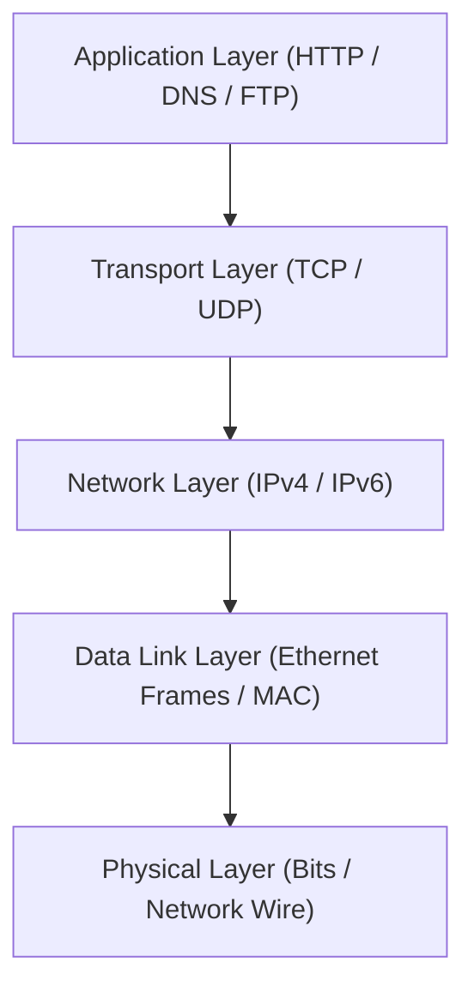

# Experiment 08: Theory & Conceptual Background

---

## 🦈 1. Network Packet Capture & OSI Layers

Packet sniffing places a network interface card (NIC) into **Promiscuous Mode**, allowing it to capture all frame headers and payloads passing across the Ethernet segment regardless of destination MAC address.

---

## 🔓 2. HTTP vs HTTPS & Plaintext Exposure

- **Unencrypted HTTP (Port 80):** Transmits request headers, cookies, GET parameters, and POST request bodies in raw ASCII plaintext. Anyone on the network path can inspect credentials using packet analyzers.
- **Encrypted HTTPS (Port 443):** Wraps HTTP within **Transport Layer Security (TLS 1.3 / 1.2)** encryption. Payloads and application headers are encrypted using symmetric session keys derived via Diffie-Hellman Key Exchange.

---

## 🎯 3. Essential Wireshark Display Filters

| Filter Purpose | Wireshark Display Filter Expression |
| :--- | :--- |
| **Filter by Target IP** | `ip.addr == 192.168.56.102` |
| **Filter HTTP POST Requests** | `http.request.method == "POST"` |
| **Filter TCP SYN Handshake** | `tcp.flags.syn == 1 && tcp.flags.ack == 0` |
| **Filter DNS Queries** | `dns.flags.response == 0` |
| **Filter HTTP Authentication** | `http.authorization || http.request.uri contains "login"` |
