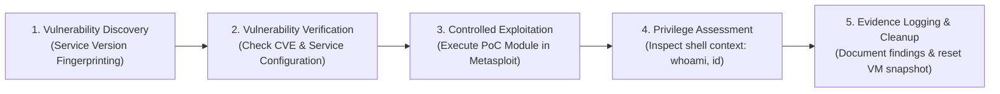

# Experiment 09: Theory & Conceptual Background

---

## 🔬 1. Controlled Exploit Lifecycle

Exploitation in ethical hacking is the controlled demonstration that an identified vulnerability can be leveraged to execute unauthorized commands or bypass access controls.

---

## 💻 2. Payload Types: Bind Shell vs Reverse Shell

- **Bind Shell:** The target server opens a listening network port (e.g., port 4444) and binds an interactive command shell (`/bin/sh`) to it. The attacker connects to the target port. (Easily blocked by target firewalls).
- **Reverse Shell:** The target server initiates an outbound TCP connection back to a listener port on the attacker's machine (e.g., Kali IP `192.168.56.101:4444`) and redirects stdout/stdin/stderr. (Bypasses inbound firewall rules).

---

## 🛡️ 3. Post-Exploitation Privilege Boundaries

Once a shell session is established, ethical hackers assess privilege context without causing system destruction or data modification:
- **`whoami`:** Prints active user account name (e.g., `root`, `daemon`, `www-data`).
- **`id`:** Prints Real and Effective User IDs (UID) and Group IDs (GID).
- **`uname -a`:** Records target kernel release and architecture.
- **`hostname`:** Confirms system identity.

---

## 🧹 4. System Recovery & Snapshot Cleanup

Post-exploitation testing must leave target systems in a known good state. In VirtualBox/VMware, students utilize **Virtual Machine Snapshots** (`Initial-Clean-State`) to restore target VM memory and disk state instantly after experiment completion.
